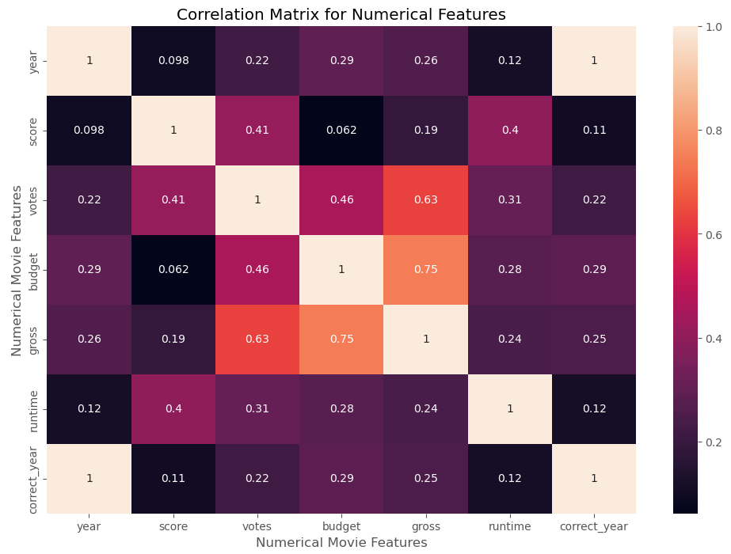

# Correlation Analysis of Movies using Python

## Table of Contents
  - [Objective](#objective)
  - [Dataset](#dataset)
  - [Tools](#tools)
  - [Methodology](#methodology)

## Objective
This project seeks to find what factors can influence the gross earnings for the movies. By conducting a correlation analysis, we will identify the key variables that have significant impacts on movie revenues.

## Dataset

The movies dataset (https://www.kaggle.com/datasets/danielgrijalvas/movies?select=movies.csv) contains the following key features:
- Name: Name of the movie
- Rating: Rating of the movie (R, PG, etc.)
- Genre: Main genre of the movie (Action, adventure, drama, etc.)
- Year: Year of release
- Released: Release date  
- Score: IMDb user rating
- Votes: Number of user votes
- Director: The director of the movie   
- Writer: Writer of the movie
- Star: Main actor/actress
- Country: Country of origin  
- Budget: The budget of a movie. 
- Gross: revenue of the movie
- Company: the production company
- Runtime: duration of the movie

## Tools

- Python libraries
  - pandas for data manipulation
  - numpy for numerical analysis.
  - matplotlib and seaborn for data visualization.
  
## Methodology

### 1. Data Collection

- Gather the dataset that contains the information about movies


### 2. Data Preprocessing

- Handle missing data
- Change the type in columns such as budget, and votes.
- Correct the year column adding a new column correct_year

```python
#if there are 2 or more of missing values in a row-->eliminate row
df = df.dropna(thresh=len(df.columns) - 1)

#Replace missing values in the budget column with the median
median = df['budget'].median()
df['budget'] = df['budget'].fillna(median)
```

### 3. Correlation Analysis

- Correlation matrix for numerical features


- Correlation matrix for all features


### 4. Visualization

- Scatter plot Budget vs Gross Earnings


- Correlation Matrix for numerical features Heatmap 



### 5. Insights and Findings

- There is a strong positive correlation between the movie's budget and its gross earnings (correlation coefficient: 0.74). This suggests that movies with higher budgets tend to earn more.
- There is also a strong correlation between the number of votes a movie receives and its gross earnings (correlation coefficient: 0.63). This indicates that movies which attract more public attention and generate more reviews tend to earn more.
- Both director and writer variables show very weak correlations with gross earnings (around -0.03). This suggests that the involvement of a particular director or writer may not significantly influence the earnings.


